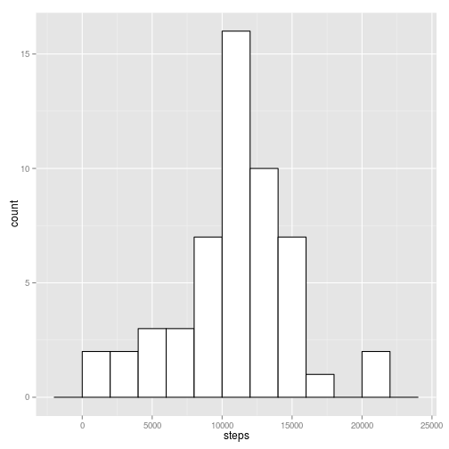
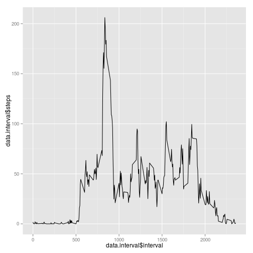
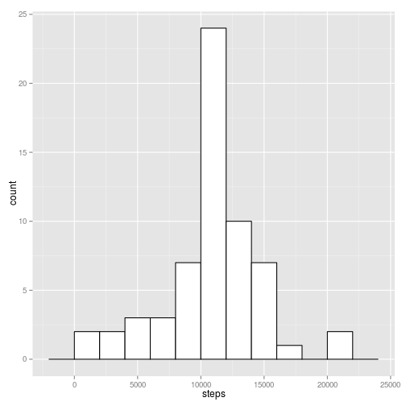
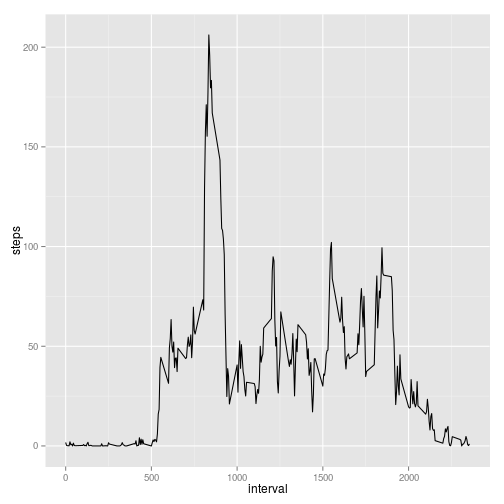
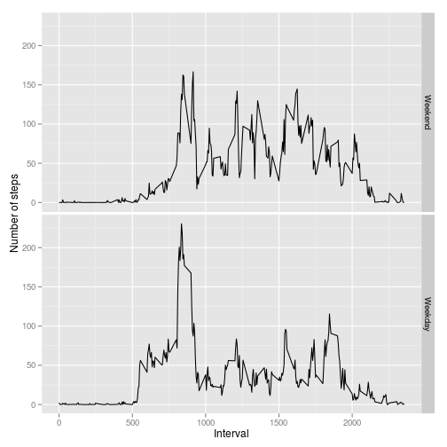

# Reproducible Research: Peer Assessment 1


## Loading data

Load and transform the data.


```r
library(ggplot2)
library(plyr)
data <- read.csv("activity.csv")
data$date <- as.Date(data$date,format="%Y-%m-%d")
```


## Mean total number of steps taken per day

We can plot the histogram of all the steps


```r
with(data,hist(steps, main="Histogram of total steps"))
```

 

But would be better to see total steps per day. For that, we need to aggregate
the data.

First we need to aggregate number of steps per day


```r
data.perday <- aggregate(steps ~ date, data, sum, na.rm=T)
```

Now we can see histogram of steps per day


```r
ggplot(data.perday, aes(steps))+geom_histogram(binwidth=2000,fill="white",colour="black")
```

 


Mean and media steps per day


```r
mean(data.perday$steps,na.rm=T)
```

```
## [1] 10766
```

```r
median(data.perday$steps,na.rm=T)
```

```
## [1] 10765
```


## Average daily activity pattern

Now we aggregate steps per interval


```r
data.interval <- aggregate(steps ~ interval, data, mean, na.rm=T)
ggplot(data.interval, aes(x=data.interval$interval, y=data.interval$steps))+geom_line()
```

 


## Imputing missing values

We can impute the missing values by mean values


```r
data.impute <- adply(data, 1, function(x) if (is.na(x$steps)) {
    x$steps = round(data.interval[data.interval$interval == x$interval, 2])
    x
} else {
    x
})
```

Now lets look at the per day and per interval patterns again after imputing
missing values


First we need to aggregate number of steps per day


```r
data.impute.perday <- aggregate(steps ~ date, data.impute, sum)
```

Now we can see histogram of steps per day


```r
ggplot(data.impute.perday, aes(steps))+geom_histogram(binwidth=2000,fill="white",colour="black")
```

 


Mean and media steps per day


```r
mean(data.impute.perday$steps)
```

```
## [1] 10766
```

```r
median(data.impute.perday$steps)
```

```
## [1] 10762
```

Now we aggregate steps per interval


```r
data.impute.interval <- aggregate(steps ~ interval, data.impute, mean)
ggplot(data.impute.interval, aes(x=interval, y=steps))+geom_line()
```

 


## Are there differences in activity patterns between weekdays and weekends?

First find whether each day is a weekday or weekend day

```r
data.impute.weekend <- subset(data.impute, weekdays(date) %in% c("Saturday", "Sunday"))
data.impute.weekday <- subset(data.impute, !weekdays(date) %in% c("Saturday", "Sunday"))

data.impute.weekend <- aggregate(steps ~ interval, data.impute.weekend, mean)
data.impute.weekday <- aggregate(steps ~ interval, data.impute.weekday, mean)

data.impute.weekend <- cbind(data.impute.weekend, day = rep("Weekend"))
data.impute.weekday <- cbind(data.impute.weekday, day = rep("Weekday"))


data.impute.week <- rbind(data.impute.weekend, data.impute.weekday)
```

Now plot the data

```r
ggplot(data.impute.week, aes(x = interval, y = steps)) + geom_line() + facet_grid(day ~ 
    .) + labs(x = "Interval", y = "Number of steps")
```

 
